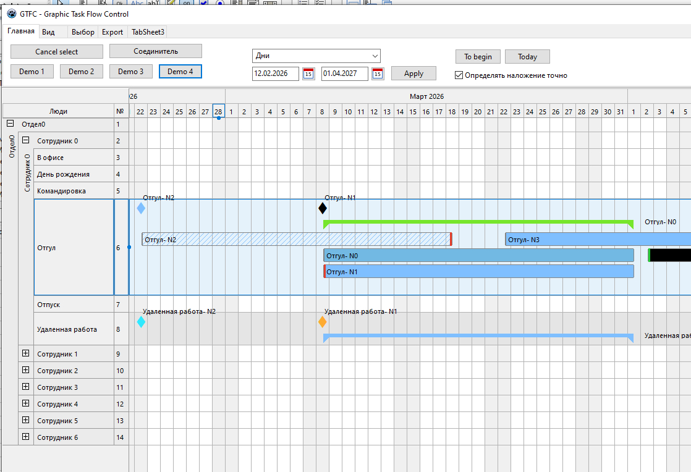
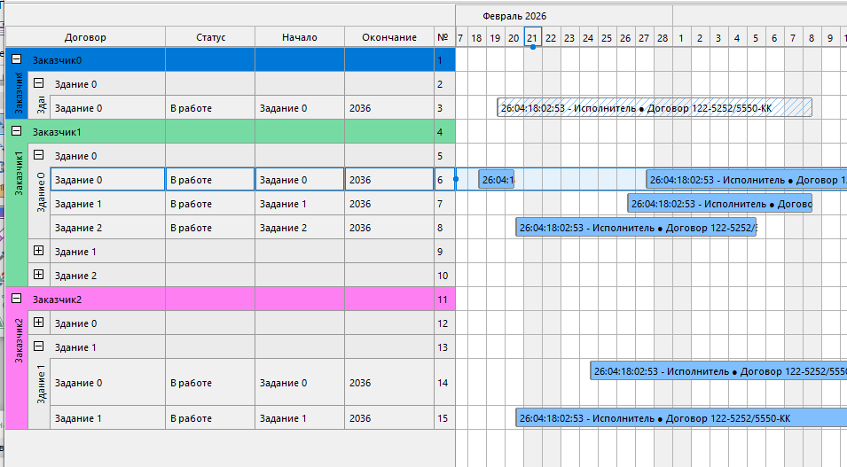
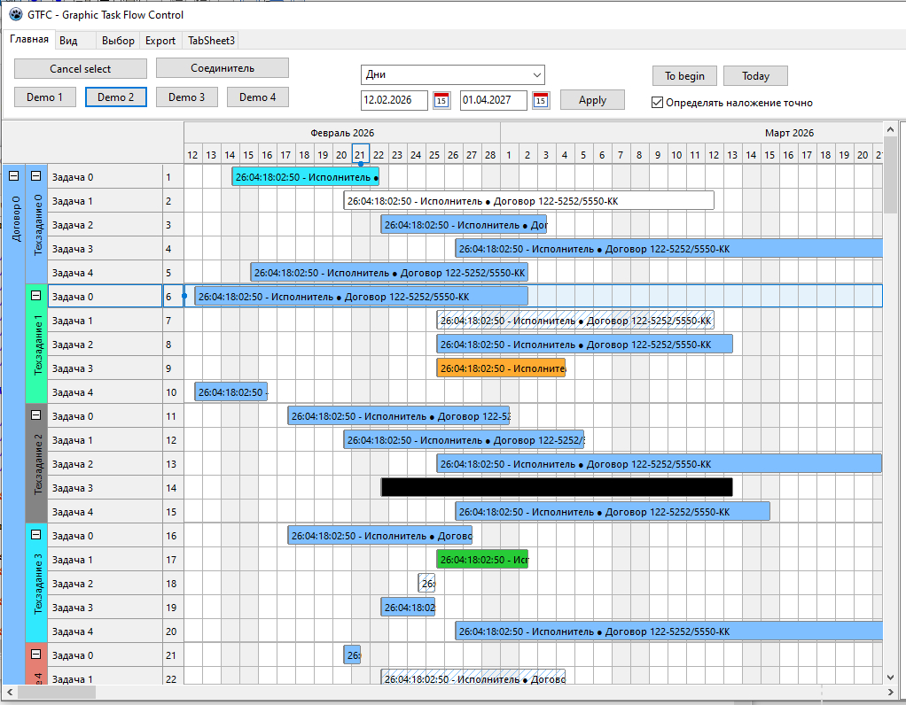

# pk_gtfc /  Graphic Task Flow Control
Component show chart gantt for Lazarus\CodeTyphone

## Version
	
  current 0.55 (2026-04-18)

## Notice
The design is based on a visual object container component adapted and redesigned for Gantt charts. The coordinate system has been simplified to integers, but the white space is limited only by the range of displayed dates.

Existing functionality:
- Task rendering;
- Task range rendering;
- Milestone rendering;
- Link rendering;
- Mouse-based task dragging on the time grid;
- Separate menus for the grid and tree areas;
- Built-in JPEG export;

Possible update plans:
- Editable tree column widths;
- Sorting by clicking on tree headers;
- Keyboard control;
- More attractive link line rendering;
- Alternative canvas option (possibly BGRA, Image32)

## Screenshots

## License

LGPL